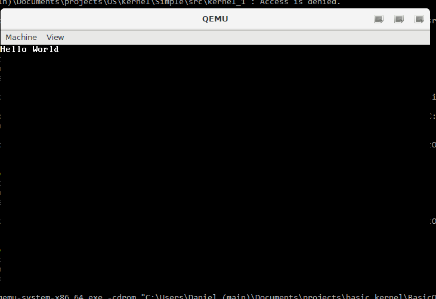
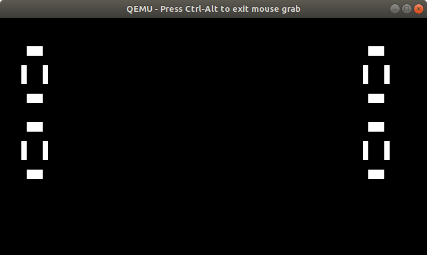

## Basic_Kernel : A Basic Attempt to Make A Kernel

This is a basic kernel, hardly an OS. So far I made my own linker script, bootloader, memory manager (albeit with issues) and some basic graphics

, text can be displayed, and printed.
 running.

This runs in QEMU. 

### How to build:

Clone the source, and make sure you have all of the build tools required (gcc, gas, make, grub-mkrescue). Then go to src and run `make package`. 

If you have qemu installed, you can run it automatically with `make run`.

To clean up the files, you can run `make clean`. 